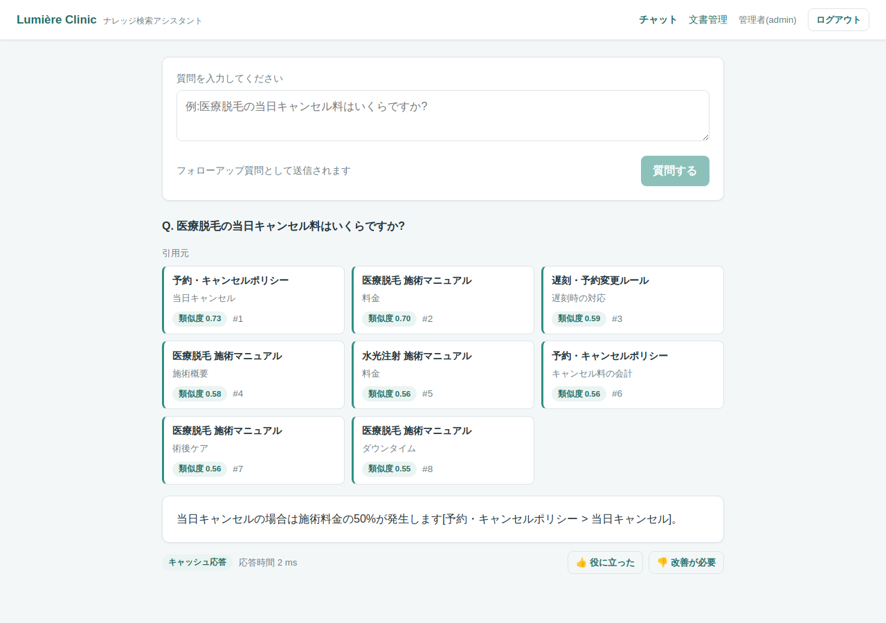
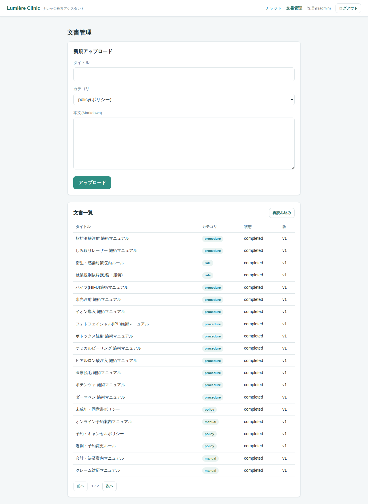
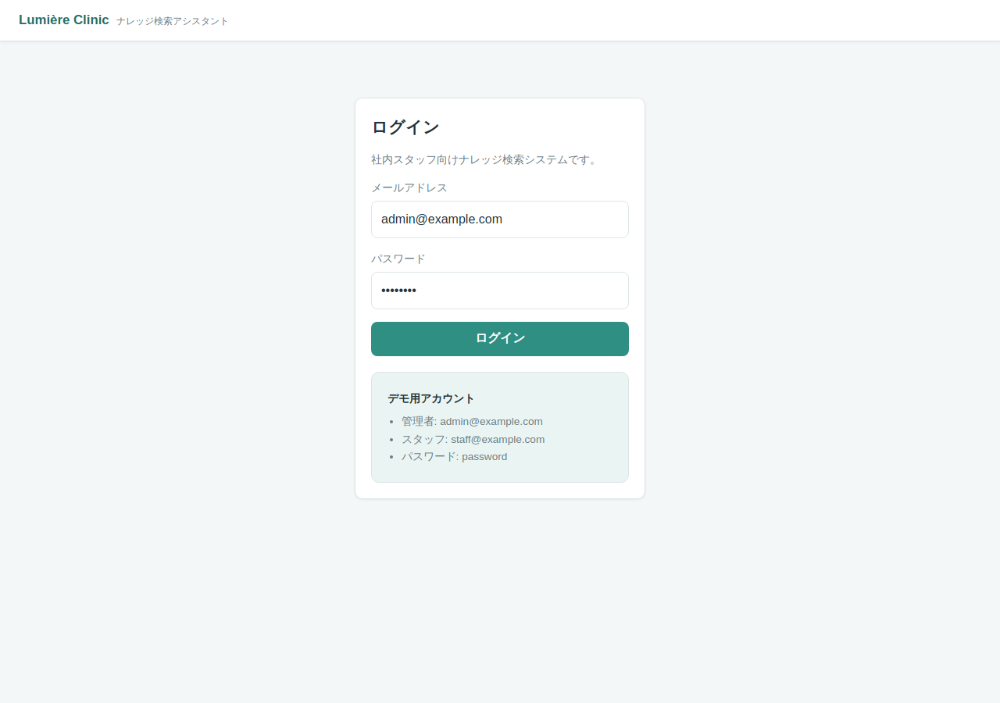
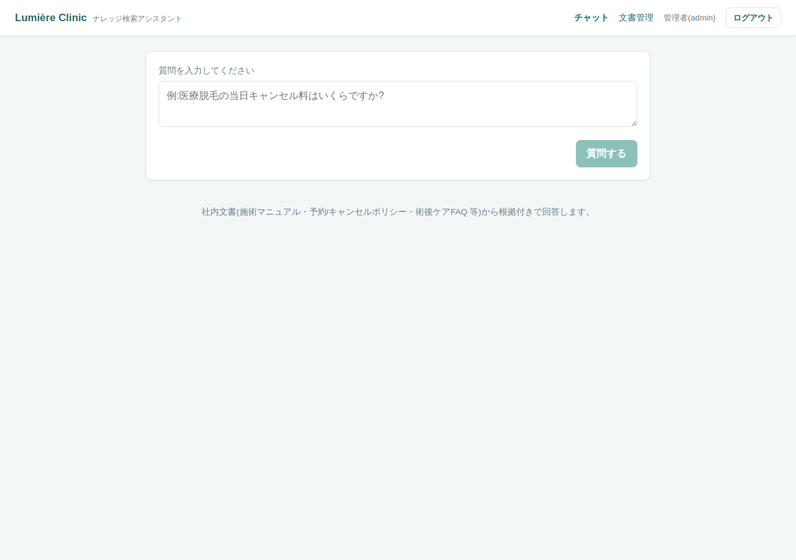

# clinic-rag-assistant

架空の美容クリニック「Lumière Clinic(リュミエールクリニック)」の社内スタッフ向けナレッジ検索システム。
施術マニュアル・予約/キャンセルポリシー・術後ケアFAQ・接客対応マニュアルなどの社内文書を対象に、
RAG(Retrieval-Augmented Generation)で根拠付きの回答を返します。

### スクリーンショット

ローカルLLM(Ollama / qwen2.5:7b + bge-m3)で実際に生成した、**引用元付き回答**の例です。

**チャット(引用元カード + 根拠に基づく回答)**



> 回答: 「当日キャンセルの場合は施術料金の50%が発生します**[予約・キャンセルポリシー > 当日キャンセル]**。」
> — 検索でヒットしたチャンク(類似度付き)を先行表示し、その根拠だけを使って引用付きで回答します。

**文書管理(管理者)**



<details>
<summary>ログイン画面 / 質問前のチャット画面</summary>




</details>

## なぜこの題材か

- 医療・美容ドメインでの実務経験を活かし、実在しうる業務課題(新人スタッフの問い合わせ対応コスト、マニュアルの検索性の低さ)を解決するシステムとして設計
- 「回答の根拠となる文書を必ず提示する」「わからないことは推測せず答えない」という、**誤情報が許されないドメインでのAI活用の型**を実装で示す

## 3つの証明ポイント

### 1. RAGを実務レベルで構築できる
- pgvectorによるベクトル検索 + Claude APIによる回答生成
- チャンク分割戦略・メタデータ設計・引用元の提示までを含む一連の実装
- 詳細: [docs/02_architecture.md](./docs/02_architecture.md), [docs/04_db_design.md](./docs/04_db_design.md)

### 2. LLMの回答品質を継続的に担保できる(評価ハーネス)
- ゴールデンデータセット(質問と期待回答のペア)に対する回帰テスト
- 検索精度(Recall@k)と回答品質(LLM-as-a-Judge)の自動スコアリング
- プロンプト変更・モデル更新時のデグレ検知をCIで実行
- 詳細: [docs/05_eval_harness.md](./docs/05_eval_harness.md)

### 3. 性能を計測し、数字で改善を示せる(負荷試験)
- k6によるスパイクシナリオでベースライン計測(rps / p95 / p99)
- Redisキャッシュ(stale-while-revalidate)によるスタンピード対策
- pgvectorインデックス(HNSW vs IVFFlat)のベンチマーク比較
- 文書取り込みジョブの同時実行制御(楽観ロック)
- 詳細: [docs/06_load_testing.md](./docs/06_load_testing.md)

## ドキュメント構成

| ドキュメント | 内容 |
|---|---|
| [01_requirements.md](./docs/01_requirements.md) | 要件定義(想定顧客・ユースケース・非機能要件) |
| [02_architecture.md](./docs/02_architecture.md) | システム構成・処理フロー |
| [03_api_design.md](./docs/03_api_design.md) | APIエンドポイント設計 |
| [04_db_design.md](./docs/04_db_design.md) | DBスキーマ・チャンク戦略 |
| [05_eval_harness.md](./docs/05_eval_harness.md) | 評価ハーネス設計 |
| [06_load_testing.md](./docs/06_load_testing.md) | 負荷試験計画とチューニング方針 |
| [docs/adr/](./docs/adr/) | 設計判断の記録(Architecture Decision Records) |
| [CLAUDE_CODE_HANDOFF.md](./docs/CLAUDE_CODE_HANDOFF.md) | Claude Code向け実装指示書 |

## 実装フェーズ

| Phase | 内容 | 状態 |
|---|---|---|
| Phase 0 | 設計ドキュメント一式 | ✅ 完了 |
| Phase 1 | RAG本体(文書取り込み・検索・回答生成・UI) | ✅ 完了 |
| Phase 2 | 評価ハーネス(ゴールデンセット・回帰テスト・CI) | ✅ 完了 |
| Phase 3 | 負荷試験と性能改善(k6・キャッシュ・インデックス比較) | ✅ 完了 |

## 実装ハイライト

- **Laravel 11 + Vue 3 + PostgreSQL 16(pgvector)+ Redis** を Docker Compose で一括起動
- 見出し構造ベースのチャンク分割(ADR-002)、HNSW ベクトル検索(ADR-003)、
  引用元を先行送信する **SSE ストリーミング**回答、根拠なし時の **no_answer** 分岐
- 外部API(Claude / embedding)は **interface + Fake/実API** で差し替え可能。
  **既定は Fake のためAPIキー無しで即起動・全機能デモ可能**(実APIは `.env` で切替)
- 評価ハーネス(`eval:run`): Recall@k(層1)+ LLM-as-a-Judge(層2)、前回run差分レポート、CIゲート
- 負荷試験(k6 + `bench:*`): キャッシュ / SWR+ロック / HNSW-IVFFlat比較 / 楽観ロックの before/after 実測
- テスト **25件**(ChunkSplitter単体・認証・取り込み・検索・楽観ロック・評価ハーネス)

## ローカル起動(APIキー不要で即動作)

```bash
docker compose up -d --build     # app / queue / postgres(pgvector) / redis / node
cp .env.example .env             # 既定ドライバは fake(キー不要)
docker compose run --rm app php artisan key:generate
docker compose run --rm app php artisan migrate --seed   # ダミー文書30本を取り込み(completed)
docker compose run --rm node npm run build               # フロントSPAをビルド(public/build)
# SPA は http://localhost:8000 で確認可能
# デモアカウント: admin@example.com / staff@example.com(いずれも password="password")
```

### 本物のAI回答を出す(2通り)

回答ドライバは3種類(`fake` / `anthropic` / `ollama`)を `.env` で切替可能。

**A. ローカルLLM(Ollama・無料・オフライン)** — 課金なしで本物の日本語回答を出す:
```bash
brew install ollama && ollama serve            # Mac にネイティブ導入(GPU利用)
ollama pull qwen2.5:7b && ollama pull bge-m3    # 回答用 + 埋め込み(1024次元)
# .env を切替
#   LLM_DRIVER=ollama / EMBEDDING_DRIVER=ollama
docker compose run --rm app php artisan migrate:fresh --seed   # ollamaの埋め込みで作り直す
```
DockerコンテナからはMac上のOllamaに `host.docker.internal:11434` で接続します。

**B. 実API(最高品質・従量課金)**:
`.env` で `LLM_DRIVER=anthropic` / `EMBEDDING_DRIVER=voyage` に変更し、
`ANTHROPIC_API_KEY`(platform.claude.com)/ `EMBEDDING_API_KEY`(voyageai.com)を設定。
※ Anthropic API は Claude Pro サブスクとは別課金です。

## 性能改善の実測(before / after)

ローカル Docker Compose・フェイクLLM(固定2s)での相対改善(詳細: [docs/06 §8](./docs/06_load_testing.md)):

| 対策 | before | after | 効果 |
|---|---|---|---|
| 回答キャッシュ(TTL) | 生成 2.39s | ヒット 0.24s(サーバ内 4ms) | 人気質問を約10倍高速化 |
| SWR + 再生成ロック(ADR-004) | 同時失効で LLM生成 **50回** | **1回**に収束 | スタンピード解消・APIコスト削減 |
| HNSW index(ADR-003) | 全件スキャン p95 17.1ms | HNSW p95 **1.47ms**(Recall 0.998) | 約12倍高速・高Recall |
| 楽観ロック(ADR-005) | 10並列更新で不整合あり | **1成功 / 9×409・不整合ゼロ** | 編集消失・二重取り込み防止 |

## 検証コマンド

```bash
# テスト(全機能・APIキー不要)
docker compose run --rm app php artisan test

# 評価ハーネス
docker compose run --rm app php artisan eval:seed
docker compose run --rm app php artisan eval:run --only=retrieval   # 層1のみ(高速)
docker compose run --rm app php artisan eval:run                    # 層1+層2(Judge)

# 負荷試験の再現
docker compose run --rm app php artisan bench:stampede --concurrency=50   # スタンピード計測
docker compose run --rm app php artisan bench:vector --index=hnsw --count=10000
NET=clinic-rag-assistant_default
docker run --rm --network $NET -v "$PWD/load:/load" grafana/k6 run /load/s4_ingest_contention.js \
  -e BASE_URL=http://app:8000 -e DOC_ID=1 -e VERSION=1 -e VUS=10
```

> **スクリーンショット**: SPA(チャット・引用元カード・管理画面)は `docker compose up` 後に
> http://localhost:8000 で確認できます。
